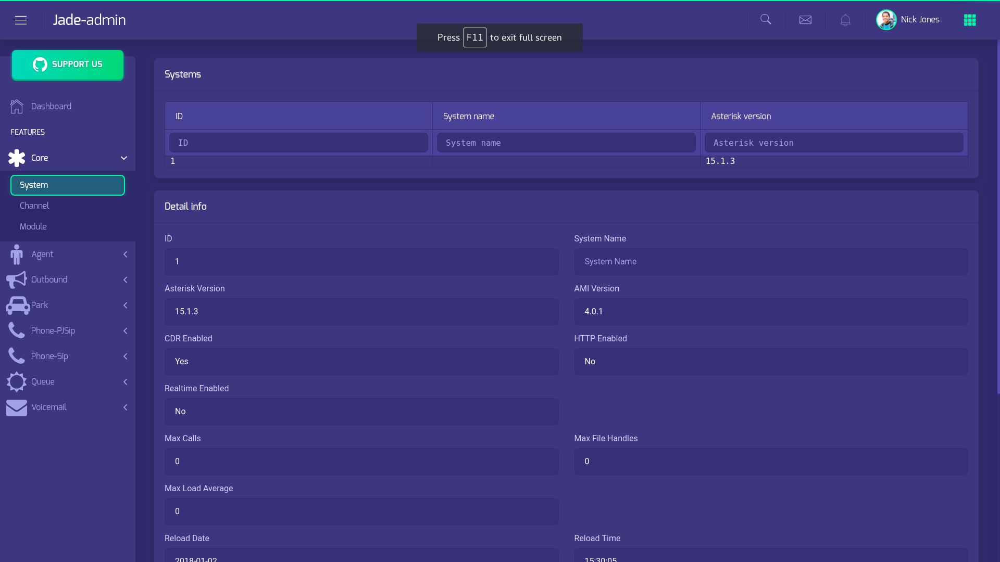

## jade-admin
The jade-admin is a simple administrator tool for jade.

## Installing
Required jade(https://github.com/pchero/jade).

```
$ npm install
$ npm start
```

## Screenshot
[](./jade-admin.png)

## License
BSD License

## Remember 2014.04.16
* Still remember 2014.04.16
* Rest in peace..
* https://en.wikipedia.org/wiki/Sinking_of_MV_Sewol
